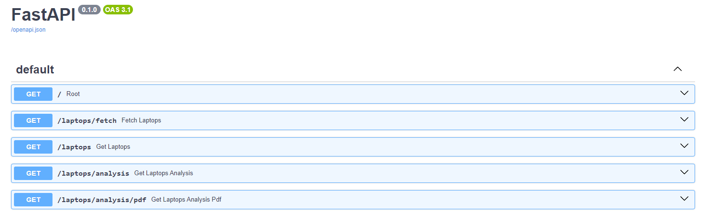
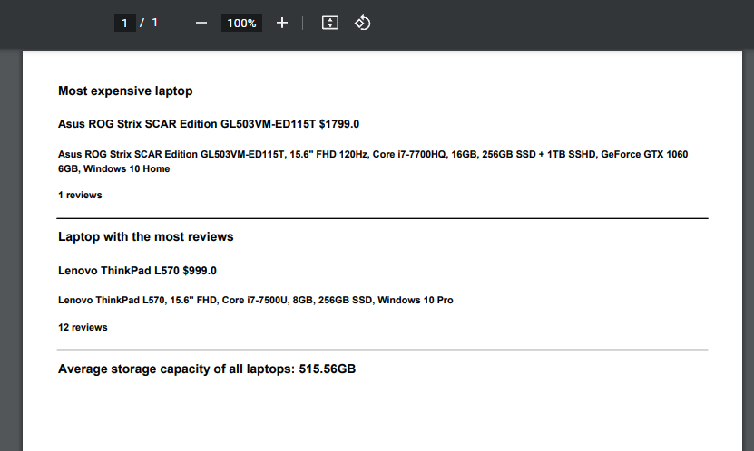

# E-commerce Data Analysis Application

## Setup

```bash
$ py -3.11 -m venv venv
$ source venv/bin/activate # Or venv\Scripts\activate for Windows
$ pip install -r requirements.txt
```

## Run it

Run the server with:

```bash
$ uvicorn main:app --reload
```

## Check it

Open your browser at http://localhost:8000/docs  
You will see the UI


### Fetching laptops

Open your browser at http://localhost:8000/laptops/fetch  
This API will fetch laptops data and save it to database

**Note: You must run this API firstly before testing any other API**

Example:

```json lines
{
  "message": "Added 117 new laptops",
  "data": [
    ...
  ]
}
```

### Get laptops data

Open your browser at http://localhost:8000/laptops  
This API will return current laptops data in our database

Example:

```json lines
[
  {
    "id": 516,
    "title": "Packard 255 G2",
    "price": 416.99,
    "review_count": 7,
    "storage": "500GB",
    "storage_in_gb": 500
  },
  {
    "id": 517,
    "title": "Aspire E1-510",
    "price": 306.99,
    "review_count": 2,
    "storage": "500GB",
    "storage_in_gb": 500
  },
  ...
]
```

### Get analysis

Open your browser at http://localhost:8000/laptops/analysis  
This API result contains:

- Identify the most expensive laptop.
- Determine the laptop with the most reviews.
- Calculate the average storage capacity of all scraped laptops.

Example:

```json
{
  "most_expensive_laptop": {
    "id": 544,
    "title": "Asus ROG Strix SCAR Edition GL503VM-ED115T",
    "price": 1799,
    "review_count": 1,
    "storage": "256GB SSD + 1TB SSHD",
    "storage_in_gb": 1280
  },
  "most_reviews_laptop": {
    "id": 539,
    "title": "Lenovo ThinkPad L570",
    "price": 999,
    "review_count": 12,
    "storage": "256GB SSD",
    "storage_in_gb": 256
  },
  "average_storage_capacity": 515.5555555555555
}
```

### Get analysis in PDF

Open your browser at http://localhost:8000/laptops/analysis/pdf
